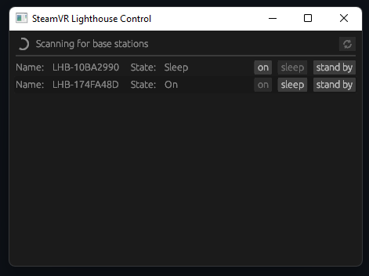

# SteamVR Lighthouse Control

Small Rust application for controlling the power state of SteamVR Base Stations.

**Only 2.0 base stations are supported.**

## Usage

To start the application, simply call `cargo run`